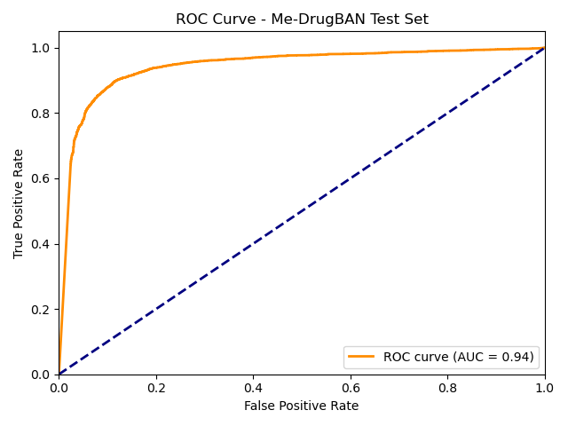
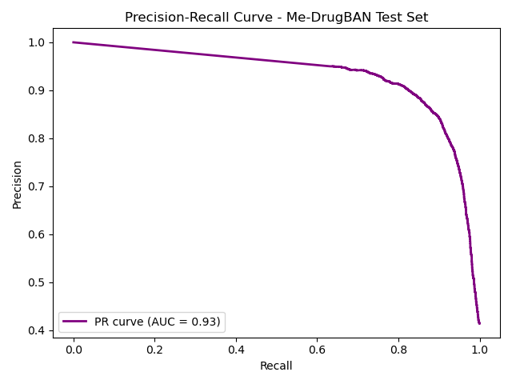
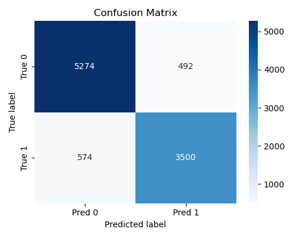

# Me-DrugBAN: Results and Evaluation

This document summarizes the main results and evaluation metrics for the Me-DrugBAN project, an annotated and reproducible reimplementation of the original DrugBAN deep learning pipeline for drug-target interaction (DTI) prediction.

---

## **Evaluation Metrics on BindingDB Test Set**

- **Test Accuracy:** 0.8917
- **ROC-AUC:** 0.9430
- **F1 Score:** 0.8678
- **Precision:** 0.8768
- **Recall:** 0.8591

**Confusion Matrix:**
```
[[5274  492]
 [ 574 3500]]
```
- True Negatives: 5274
- False Positives: 492
- False Negatives: 574
- True Positives: 3500

---

## **Key Visualizations**

### ROC Curve


### Precision-Recall Curve


### Confusion Matrix


### Histogram of Predicted Probabilities


---

## **Reproducibility & Artifacts**

- **Model Checkpoint:** `best_drugban.pt`
- **Test Predictions CSV:** [`results/test_predictions.csv`](test_predictions.csv)
- **Environment:** See `environment.yml` for exact dependencies.

---

## **How to Reproduce**

1. **Train the model:**  
   See main [README.md](../README.md) for instructions and environment setup.

2. **Evaluate the model:**  
   Run  
   ```sh
   python scripts/evaluate.py
   ```
   This will save predictions and metrics to the `results/` folder.

3. **Visualize results:**  
   Run  
   ```sh
   python scripts/plot_results.py
   ```
   Check the `results/` directory for all images and CSVs.

---

## **Summary**

- The Me-DrugBAN pipeline achieves high performance on the BindingDB split, with ROC-AUC of ~0.94.
- The training, evaluation, and visualization workflow is fully reproducible (tested on WSL).
- All model artifacts and metrics are saved for further analysis.
- The repository is ready for extension to other datasets, ablation studies, or baseline comparisons.
- For comparisons with other approaches (e.g., [CKAN-ATHP](https://github.com/Njq0104/CKAN-ATHP)), see the Related Work section in the main [README.md](../README.md).

---

**For more details, see the main [README.md](../README.md) or reach out via issues or pull requests!**